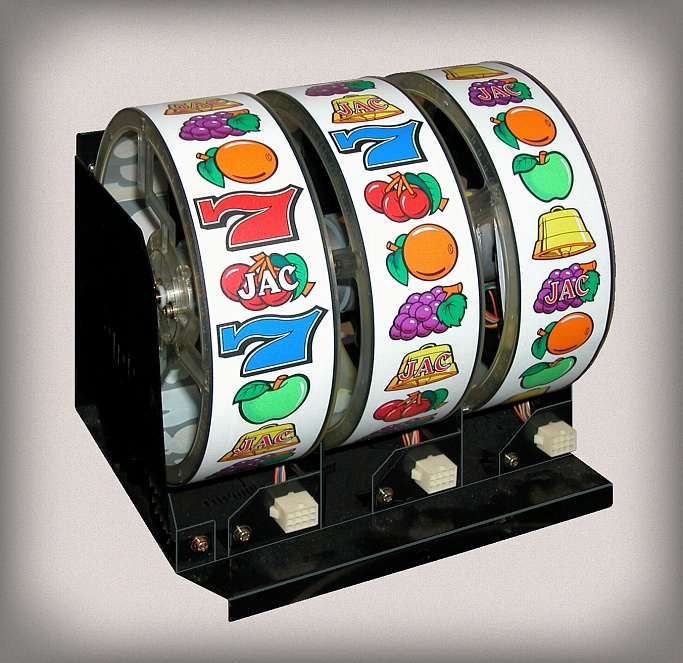
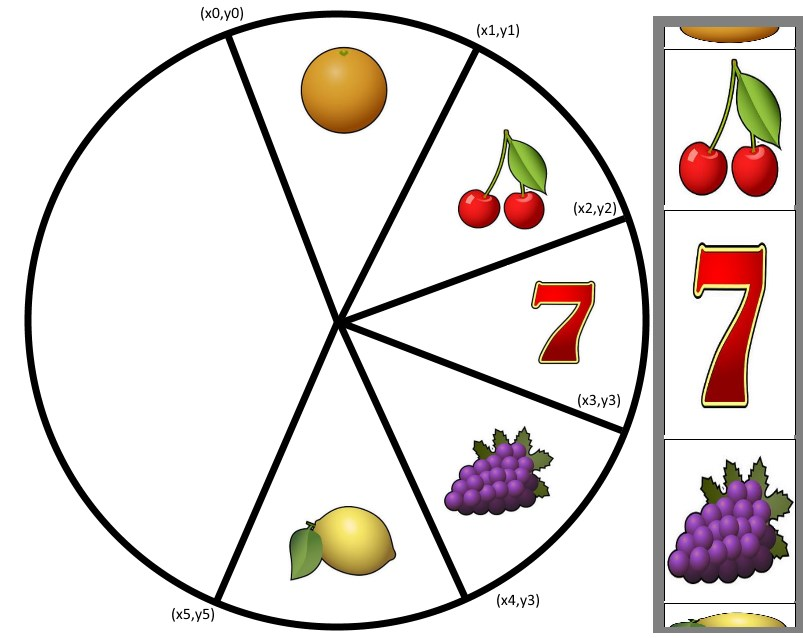
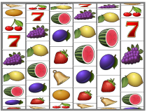
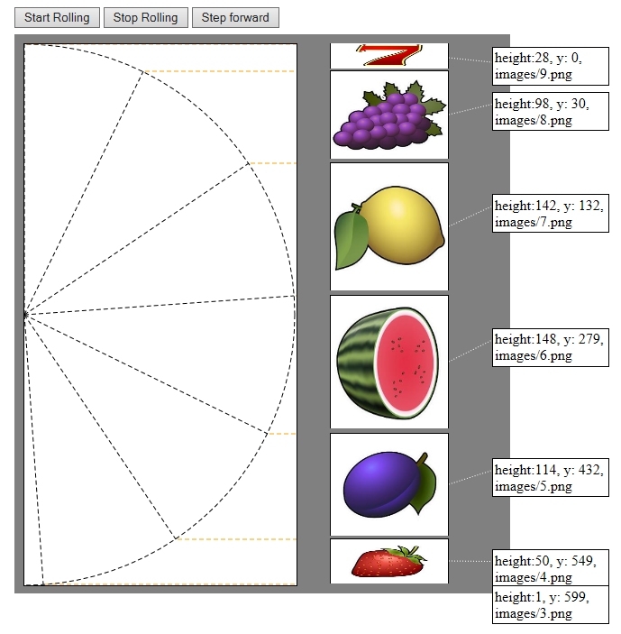

## Rendering a Fruit Machine Reel

So, this is a bit of experimentation, playing with the position and size of images to see if I can create an animated fruit machine reel.

I had the idea of showing the result of a random choice via an animation on my site homepage. I didn't want to use a canvas for this, so I wondered if I could use image tags. The first idea of how I could represent this random result was a fruit machine reel, because it also shows that there are different options, only one of which is chosen.

A fruit machine reel is circular with only about 50% visible when viewed side on. The diagram below shows that the segments are of equal size but depending upon their position can appear to have different heights when viewed by the user. By plotting the XY of the circumference of the circle we can work out the Y co-ordinate and determine the height of each segment depending on the number of degrees it covers from it's start position to it's end.

<pre class="prettyprint" >
for (var i = 0; i < 180; i += 1) {
    var x = radius * Math.sin(2 * Math.PI * (i - 90) / 360);
    var y = radius * Math.cos(2 * Math.PI * (i - 90) / 360);
    ...
}
</pre>

## A Demo

You can see what it looks like moving in an implemention on plunker. The animated reel uses AngularJs to do the animation.

[Link to plunker](https://run.plnkr.co/plunks/p2cn15/)

It works roughly like this:

* First the y coordinates on one side of a circle are calculated.
* A list of images objects is defined, each one has a reference to a PNG image.
* The position in degrees of one of the images is tracked.
* A timer fires a few times a second and steps the tracked image a set number of degrees down.
* The position of all of the other images is calculated from the one we know.
* Once the image has passed the 90 degree angle the tracked image moves to the next in the list.
* The images are shown in an html div in their calaculated position, by setting the CSS height and absolute position from the top.

The result is a reasonably convincing representation of a fruit machine reel. It runs faster in Chrome compared to Internet Explorer. It can be a little jerky so it is not perfect. In a real fruit machine you can't see the whole side of the reel, so it that respect it is less realistic or useful.

[Link to plunker](https://run.plnkr.co/plunks/hHpbWM/)

